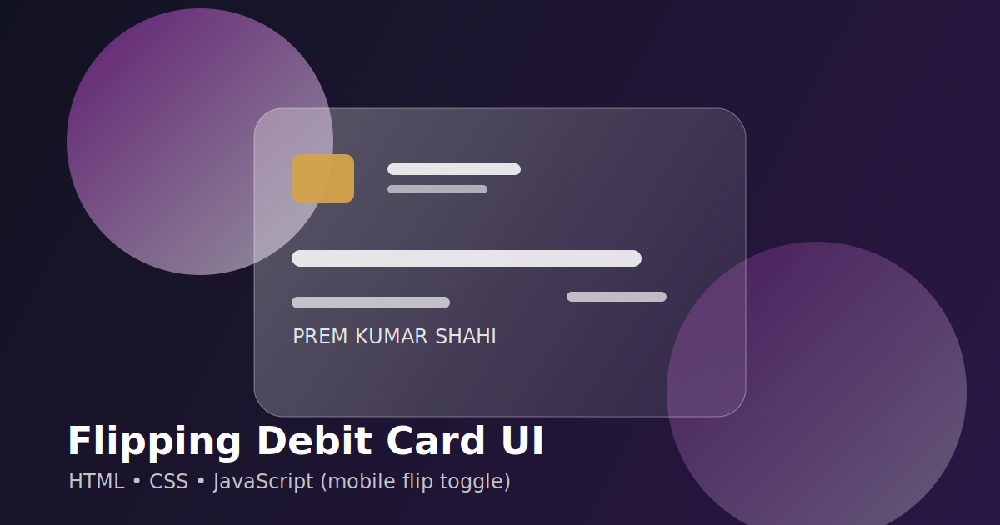

# Flipping Debit Card UI


An interactive debit/credit card concept with a glassmorphism style and 3D flip effect.

## Preview



## Highlights

- 3D flip animation for front and back card faces
- Full-screen composition with glass side panels
- Responsive layout for desktop and mobile
- Hover interaction for card flip
- Lightweight static project (no framework required)

## Tech Stack

- HTML5
- CSS3

## Project Structure

```text
.
├── assets/
│   ├── css/
│   │   └── style.css
│   ├── images/
│   │   ├── chip.png
│   │   ├── logo.png
│   │   └── preview-card.svg
├── index.html
├── LICENSE
└── README.md
```

## Run Locally

1. Clone this repository.
2. Open `index.html` in your browser.

## Do You Need JavaScript Here?

No.  
This version is intentionally built with only HTML and CSS.

## License

This project is licensed under the MIT License. See `LICENSE`.
